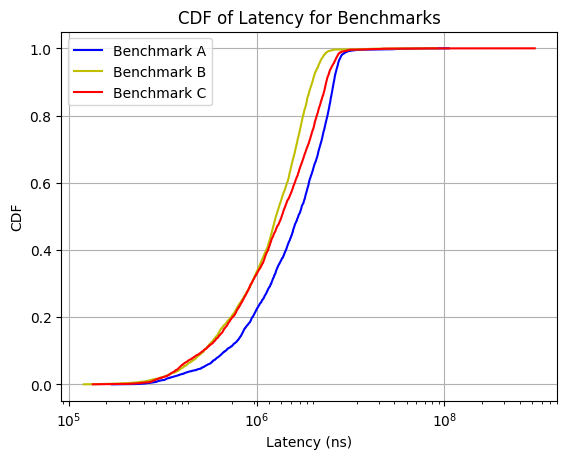
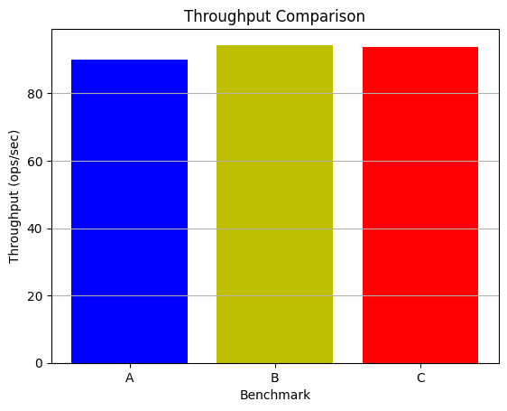

# Interpretation

### Explain the benchmark

| Benchmark | Shards | Shards of each group | Keys of each Group |
| :-------: | :----: | :------------------: | :----------------: |
|     A     |   1   |         [1]         |        [6]        |
|     B     |   2   |        [1, 1]        |       [3, 3]       |
|     C     |   2   |        [1, 1]        |       [5, 1]       |

In the test code, we can find that the number of groups equals the number of  shards, so each group stores the data in a shard. A.txt, B.txt, and C.txt define the keys of the K/V.

A only has one group for all the keys, so it has the largest burden, thus has largest latency and smallest throughput.

Following the `key2shard` function, we can find keys are assigned to shards depending on the first number, so the distribution of keys is far more balanced in Benchmark B than C, leading to a balanced burden, smaller latency, and larger throughput.

To conclude, the latency should be B < C < A, and the throughput should be B > C > A.

```
func key2shard(key string) int {
	shard := 0
	if len(key) > 0 {
		shard = int(key[0])
	}
	shard %= shardctrler.NShards
	return shard
}
```

### Explain the plots

For latency, I recorded every latency of successful Get/PutAppend request on the server end, then drawed the CDF plot. We can see the latency is B < C < A, exactly what we analyzed before.



For throughput, I recorded the total number of successful Get/PutAppend request on the server end during the test, and diveded by the consumed time. We can see the throughput is B > C > A, exactly what we analyzed before.

